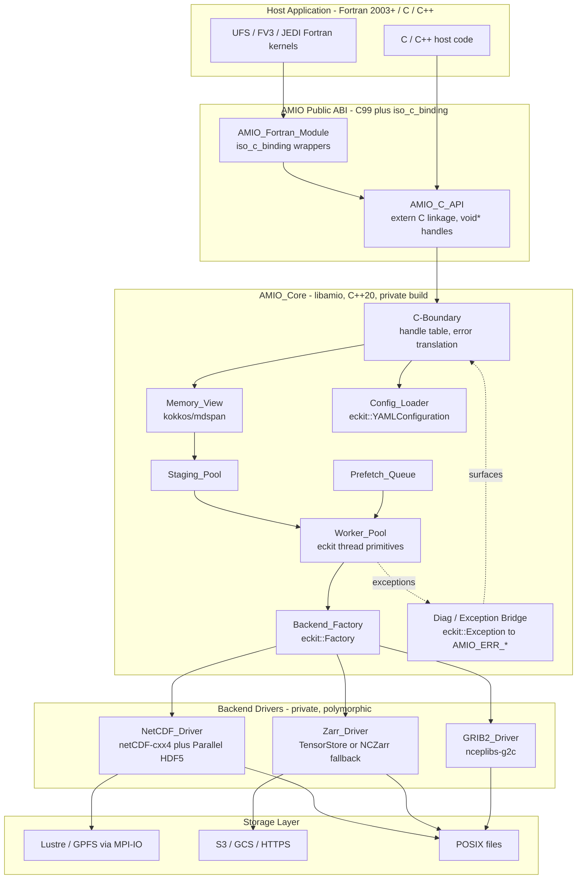
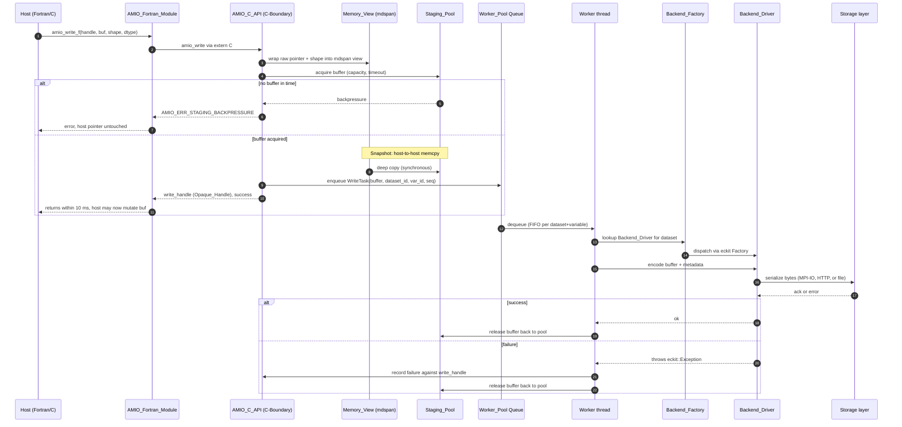
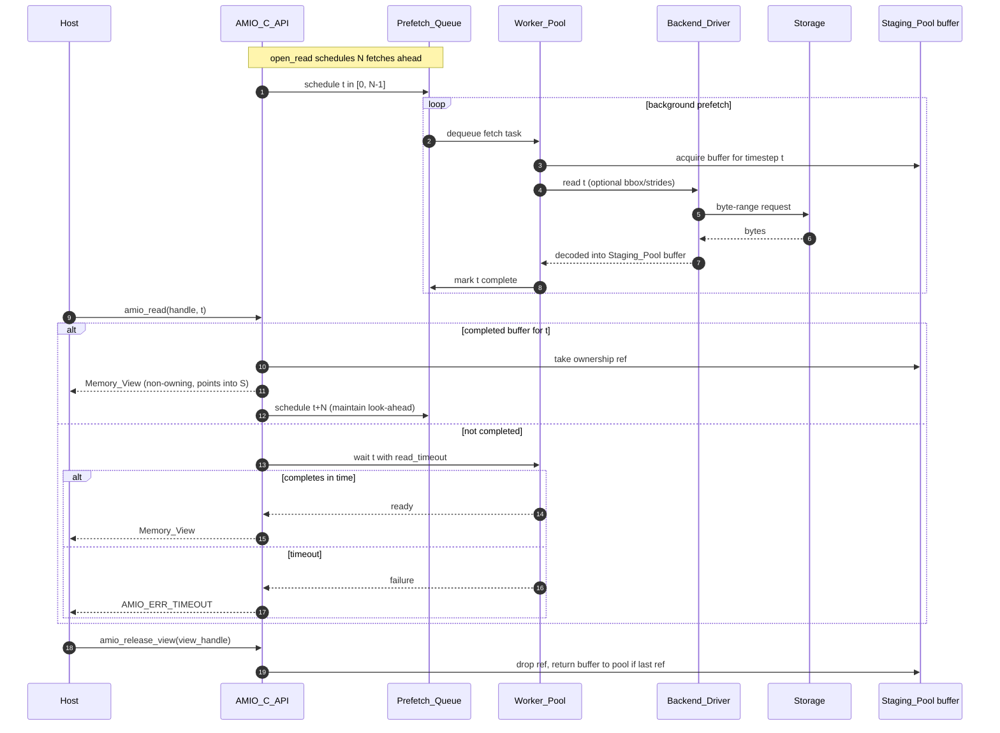
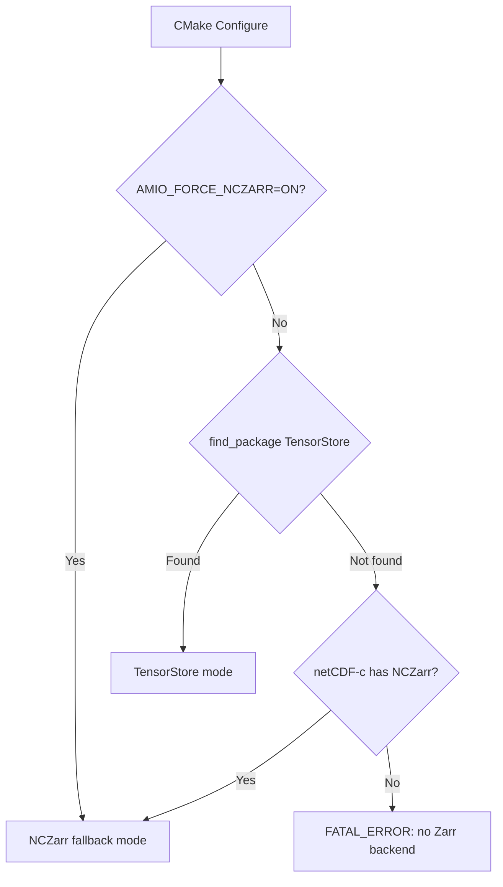
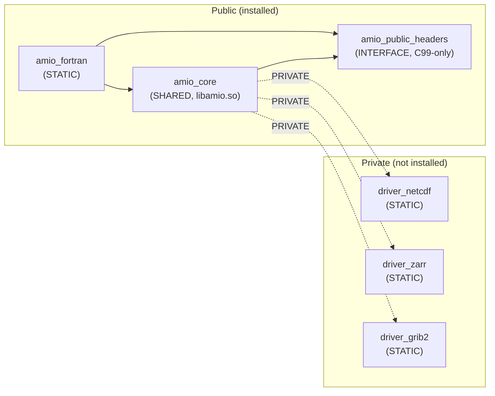

# Architecture

AMIO (Asynchronous Multidimensional I/O) is a C++20 library that decouples
scientific compute loops in NOAA NWS Earth system models from physical storage
architectures. Host applications interact with AMIO exclusively through a flat
C99 FFI surface and a Fortran 2003 `iso_c_binding` wrapper.

## Design Principles

1. **Synchronous Snapshot, Asynchronous Serialize** — A write call is
   *synchronous* with respect to capturing the host pointer (deep copy into
   staging pool), but *asynchronous* with respect to the backend write.
2. **Pointer-Swap Reads** — Read calls return a non-owning `Memory_View` that
   points into a staging pool buffer already populated by the prefetch queue.
3. **Strict ABI Isolation** — Public headers contain only C99 types. All C++
   dependencies are private to the `AMIO_Core` build.

## Layered Architecture

## End-to-End Write Path

The write path is the core of AMIO's design. The key invariant is that the
host pointer is safe to reuse immediately after `amio_write` returns.

### Key Properties

- **Pointer release boundary** (between steps 6–7): when `amio_write` returns,
  no worker thread holds a pointer to the host buffer.
- **Order preservation**: FIFO discipline per `(dataset, variable)` with a
  sequence counter assigned at enqueue time.

## End-to-End Read Prefetch Path

## TensorStore Discovery and NCZarr Fallback

At CMake configure time, AMIO determines which Zarr backend to use:

## Memory Ownership Model

| Pointer / Handle | Allocated by | Owned by | Released when | Visible to host? |
|---|---|---|---|---|
| Host source pointer | Host application | Host | Host's discretion after `amio_write` returns | Yes |
| Memory_View over host pointer (write) | C-Boundary stack | C-Boundary | End of C-Boundary call | No |
| Staging_Pool buffer (write) | `amio_init` | Staging_Pool | Worker completes write task | No |
| Staging_Pool buffer (read) | `amio_init` | Staging_Pool | Last `Memory_View` ref released | No |
| Memory_View (read, returned to host) | C-Boundary | Host (via view_handle) | `amio_release_view` | Yes |
| Opaque_Handle (core, dataset, io, view) | Handle table | C-Boundary | Corresponding finalize/close/release | Yes |

## Build Target Topology

Downstream consumers only see `AMIO::amio_core` (for C/C++) or
`AMIO::amio_fortran` (for Fortran). No third-party headers leak through
the public surface.
